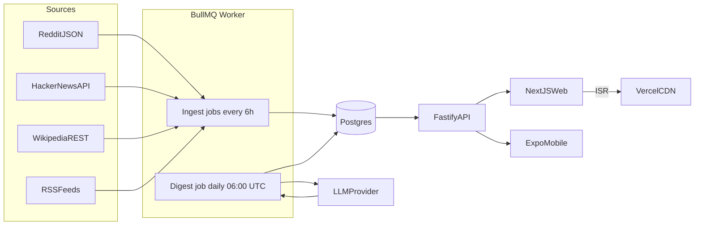
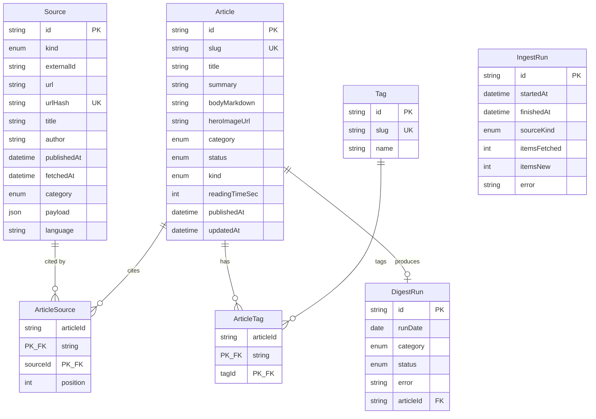

# Architecture

This document complements `docs/SRS.md`. It captures the high-level system design, data model, and the cross-cutting concerns (theme, observability, deployment).

## 1. System diagram



## 2. Repositories and packages

```text
socialMediaReplacer/
  apps/
    web/              Next.js 15 (App Router, ISR)
    mobile/           Expo + expo-router
    api/              Fastify + Prisma
    worker/           BullMQ workers (ingest, digest)
  packages/
    ui/               shared React components (web)
    theme/            tokens consumed by web + mobile
    types/            shared TypeScript types
    content/          markdown render config, reading time, sanitizer
    ingest/           source adapters (reddit, hn, wiki, rss)
  docs/               SRS, ARCHITECTURE, DEPLOYMENT
```

Workspace tooling: **pnpm workspaces** + **Turborepo**, TypeScript everywhere, ESLint + Prettier.

## 3. Data model



Notes:
- `Source.urlHash` is `sha256(canonicalize(url))`. We canonicalize by stripping fragment, sorting query params, and lowercasing the host.
- `DigestRun` uses a unique composite index on `(runDate, category)` to enforce idempotency at the DB layer.
- `Article.status` ∈ `{ DRAFT, PUBLISHED, HIDDEN }`. Public reads filter to `PUBLISHED`.
- `Article.kind` ∈ `{ DIGEST, FEATURE }`.
- All enums use Prisma `enum` types; mirrored in `packages/types`.

## 4. Ingestion pipeline

1. **Schedule.** BullMQ cron `*/360 * * * *` (every 6h, staggered by 7 minutes per source kind).
2. **Adapter call.** Each adapter in `packages/ingest` returns `Source[]` already shaped for the DB.
3. **Persist.** Worker uses `prisma.source.upsert({ where: { urlHash }, create, update: {} })` so duplicates are no-ops.
4. **Track.** A row in `IngestRun` is opened at the start and closed at the end.
5. **Failure.** Per-adapter errors are captured into `IngestRun.error` for that source kind only; other adapters continue.

## 5. Digest pipeline

1. **Trigger.** Daily at 06:00 UTC, fan out one job per category.
2. **Idempotency.** `INSERT INTO DigestRun(runDate, category, status='RUNNING')` with a unique constraint; on conflict, abort.
3. **Source selection.** Top 10 `Source` rows for the category from the last 24h, ranked by recency + provider weight.
4. **LLM call.** `LLMClient.generateDigest({ category, date, sources })` returns `{ title, summary, bodyMarkdown, citations: number[] }` where citations index back into the input sources.
5. **Persist.** Create `Article` (kind=DIGEST, status=PUBLISHED) + `ArticleSource` rows.
6. **Close run.** `DigestRun.status = 'SUCCEEDED' | 'FAILED'`, `articleId` set on success.

## 6. API surface (apps/api)

| Method | Path | Notes |
|--------|------|-------|
| GET | `/healthz` | Liveness. |
| GET | `/articles` | Query: `category`, `page`, `limit`. Public, cached. |
| GET | `/articles/:slug` | Public, cached. |
| GET | `/categories/:slug` | Public. |
| GET | `/search?q=` | Public, simple `ILIKE` over title+summary. |
| GET | `/feed.xml` | Atom 1.0, latest 50. |
| POST | `/admin/reingest` | `Bearer ADMIN_TOKEN`. Enqueues an ingest job. |
| POST | `/admin/articles/:id/hide` | `Bearer ADMIN_TOKEN`. |
| POST | `/admin/articles/:id/unhide` | `Bearer ADMIN_TOKEN`. |

Response shapes are exported from `packages/types`.

## 7. Theme system

Tokens live in `packages/theme/src/tokens.ts` and are exported in two forms:
- `cssVariables.ts` — emits `:root` and `[data-theme='dark']` blocks for the web app.
- `index.ts` — exports a JS object for React Native.

Light theme: paper background `#F4ECD8`, surface `#FBF6E9`, text `#2B2A26`, accent `#8C5A3C`.
Dark theme: background `#1B1A17`, surface `#23211D`, text `#E8E2D1`, accent `#D9A066`.
Body font: `Lora` 18px / 1.7 line-height / `max-width: 68ch`. Headings: `Source Serif 4` 600.

## 8. Deployment topology
- **Web (Vercel)** — Next.js with ISR; talks to API.
- **API (Fly.io / Railway)** — Fastify; reads/writes Postgres, enqueues admin re-ingests on Redis.
- **Worker (Fly.io / Railway)** — same image as API but starts BullMQ workers and schedulers.
- **Postgres + Redis** — managed via the same provider.
- **Mobile (Expo EAS)** — preview builds for both platforms.

## 9. Observability
- Pino structured logs in API and worker.
- Request id middleware on Fastify.
- BullMQ events logged with job id + duration.
- Health endpoint `/healthz` returns DB + Redis ping.
